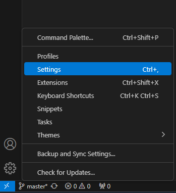
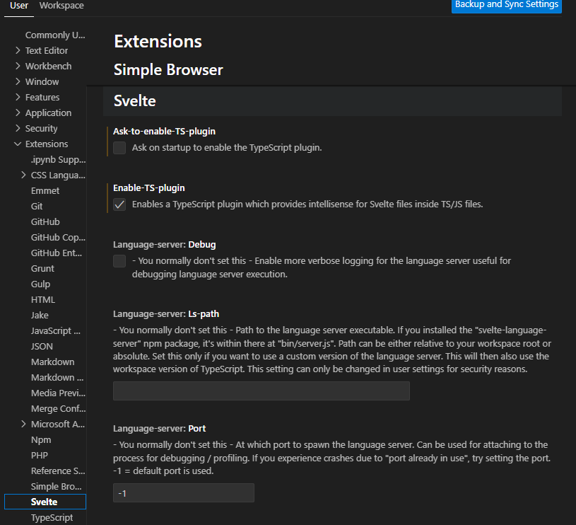

# Navigation Server  
Проект предназначен для моделирования данных первичных измерителей БИНС, а также модели движения и средств коррекции.  
Программа, содержащая имитаторы устройств и модель БИНС, запускается на http сервере. Доступ к результатам моделирования остуществляется онлайн при обращении к серверу.

## Запуск и отладка сервера
1. Установить [Visual Studio](https://visualstudio.microsoft.com/ru/). Можно использовать и другие IDE, но далее процесс настройки будет описан для Visual Studio 17 2022.
2. Установить [cmake](https://cmake.org/download/).
3. Установить [conan2](https://conan.io/downloads).
4. Запустить скрипт `sln.bat` из папки `./scripts`. Скрипт автоматически сгенерит решение для студии и откроет его.
5. Конфигурация и прект для запуска уже выбраны. В открывшемся окне следует запсутить отладку.

## Запуск и отладка клиента
1. Установить [Node.js](https://nodejs.org/en)
2. Установить [VSCode](https://code.visualstudio.com/). Можно использовать и другие IDE, но далее процесс настройки будет описан для VSCode.
3. Установить в VSCode [плагин для svelte](https://marketplace.visualstudio.com/items?itemName=svelte.svelte-vscode)
4. В VSCode зайти в `Manage` -> `Settings`:

    

5. В открывшихся настройках зайти в `Extensions` -> `Svelte`. Убрать галочку `Ask-to-enable-TS-plugin` и поставить галочку `Enable-TS-plugin`:

    

    Чуть ниже в этом же списке выбрать `ts` в выпадающем списке `Default Script Language`

6. В VSCode `File` -> `Open Folder...` открыть папку `./src/gui`.
7. Для отладки запустить `npm run dev -- --open` (более подробно см. `./src/gui/package.json` и `./src/gui/README.md`)
